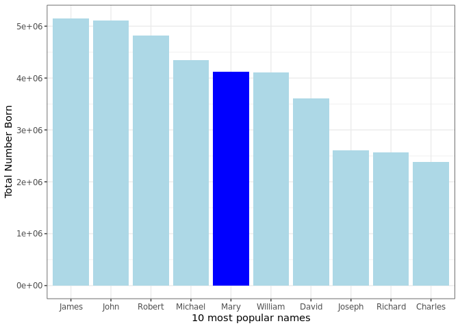

Transform Data
================

# dplyr

``` r
babynames %>% 
  summarise(total = sum(n), max = max(n), 
            min = min(n), total2 = sum(n^2))
```

    # A tibble: 1 × 4
          total   max   min        total2
          <int> <int> <int>         <dbl>
    1 348120517 99686     5 4588087742663

## Your Turn 1

Copmplete the code below to extract the rows where `name == "Khaleesi"`.
Then use `summarise()` and `sum()` and `min()` to find:

1.  The total number of children named Khaleesi
2.  The first year Khaleesi appeared in the data

*(Hint: Be sure to remove each `_` before running the code)*

``` r
babynames %>%  
  filter(name == "Khaleesi") %>% 
  summarise(total = sum(n), first = min(year))
```

    # A tibble: 1 × 2
      total first
      <int> <dbl>
    1  1964  2011

``` r
babynames %>% 
  group_by(sex) %>% 
  summarise(total = sum(n))
```

    # A tibble: 2 × 2
      sex       total
      <chr>     <int>
    1 F     172371079
    2 M     175749438

## Your Turn 2

Use `group_by()`, `summarise()`, and `arrange()` to display the ten most
popular names. Compute popularity as the *total* number of children of a
single gender given a name.

*(Hint: Be sure to remove each `_` before running the code)*

``` r
babynames %>%
  group_by(name, sex) %>% 
  summarise(total = sum(n)) %>% 
  arrange(desc(total)) %>% 
  head(10) %>% 
  ggplot() +
  geom_col(aes(x = fct_reorder(name, desc(total)), y = total, fill = sex)) +
  labs(x = "10 most popular names", 
       y = "Total Number Born") +
  guides(fill = FALSE) +
  theme_bw() +
  scale_fill_manual(values = c("blue", "lightblue"))
```

    `summarise()` has grouped output by 'name'. You can override using the `.groups`
    argument.

    Warning: `guides(<scale> = FALSE)` is deprecated. Please use `guides(<scale> =
    "none")` instead.

<!-- -->

``` r
babynames %>% 
  mutate(percent = round(100*prop, 2))
```

    # A tibble: 1,924,665 × 6
        year sex   name          n   prop percent
       <dbl> <chr> <chr>     <int>  <dbl>   <dbl>
     1  1880 F     Mary       7065 0.0724    7.24
     2  1880 F     Anna       2604 0.0267    2.67
     3  1880 F     Emma       2003 0.0205    2.05
     4  1880 F     Elizabeth  1939 0.0199    1.99
     5  1880 F     Minnie     1746 0.0179    1.79
     6  1880 F     Margaret   1578 0.0162    1.62
     7  1880 F     Ida        1472 0.0151    1.51
     8  1880 F     Alice      1414 0.0145    1.45
     9  1880 F     Bertha     1320 0.0135    1.35
    10  1880 F     Sarah      1288 0.0132    1.32
    # … with 1,924,655 more rows

## Your Turn 3

Fill in the blanks to: Rank each name *within its year and sex*.

*(Hint: Be sure to remove each `_` before running the code)*

``` r
babynames %>% 
  group_by(year, sex) %>% 
  mutate(rank = min_rank(desc(prop))) %>% 
  group_by(name, sex) %>% 
  summarise(avg_rank = mean(rank)) %>% 
  arrange(avg_rank)
```

    `summarise()` has grouped output by 'name'. You can override using the `.groups`
    argument.

    # A tibble: 107,973 × 3
    # Groups:   name [97,310]
       name      sex   avg_rank
       <chr>     <chr>    <dbl>
     1 James     M         5.45
     2 William   M         6.36
     3 John      M         6.37
     4 Joseph    M        10.3 
     5 Robert    M        11.9 
     6 Elizabeth F        12.1 
     7 David     M        14.7 
     8 Thomas    M        18.1 
     9 Mary      F        19.4 
    10 Charles   M        19.7 
    # … with 107,963 more rows

------------------------------------------------------------------------

# Take aways

-   Make tables of summaries with `summarise()`  

-   Make new variables, with `mutate()`  

-   Do groupwise operations with `group_by()`

-   Connect operations with `%>%`
